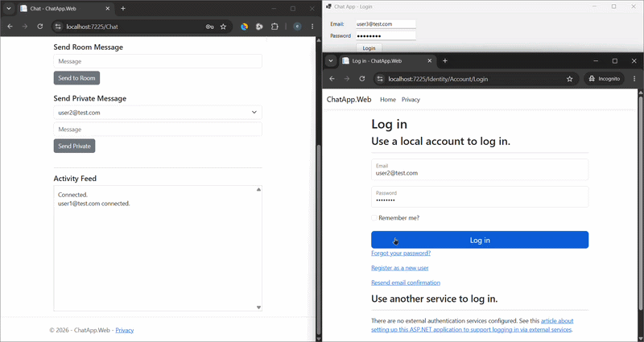
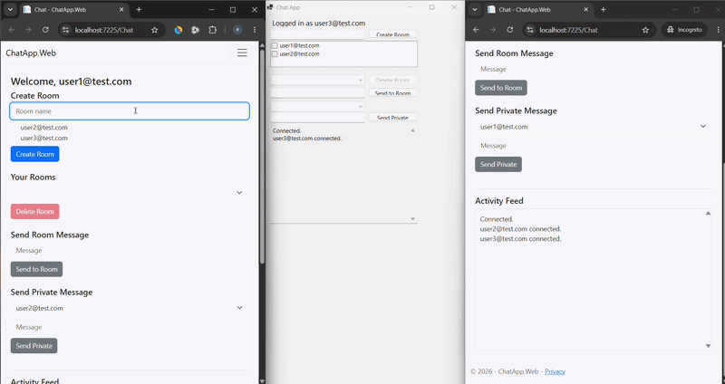
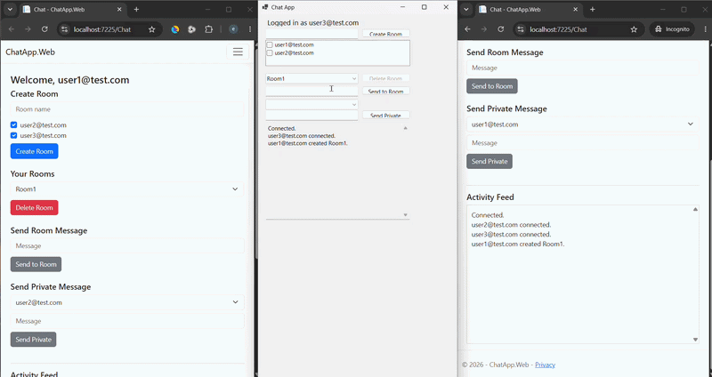
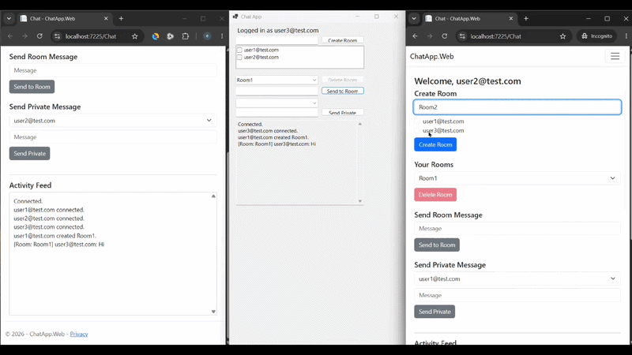
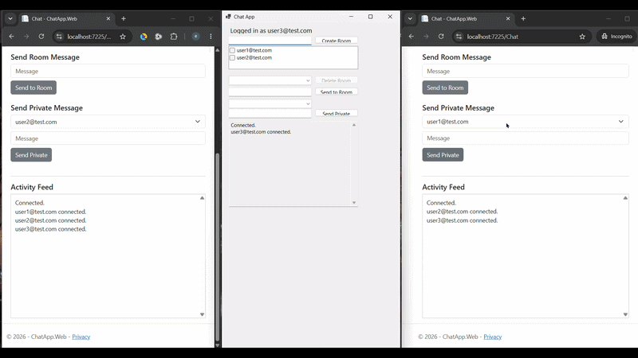
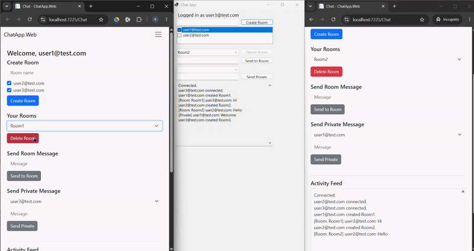

# ChatApp — Real-Time Chat with ASP.NET Core SignalR

A learning project demonstrating real-time communication using **ASP.NET Core SignalR**, with two clients sharing a single Hub: a web app (ASP.NET Core MVC) and a desktop app (WinForms).

---

## Tech Stack

| Layer | Technology |
|---|---|
| Backend | ASP.NET Core MVC (.NET 10) |
| Real-Time | ASP.NET Core SignalR |
| Auth (Web) | ASP.NET Core Identity — cookie scheme |
| Auth (Desktop) | JWT Bearer tokens |
| ORM | Entity Framework Core 10 |
| Database | SQL Server (LocalDB) |
| Desktop Client | WinForms (.NET 10) |

---

## Architecture

```
SignalR/
├── ChatApp.Web/                  # MVC + Identity + SignalR Hub
│   ├── Data/
│   │   ├── ApplicationUser.cs
│   │   ├── ChatRoom.cs
│   │   ├── ChatRoomMember.cs
│   │   ├── ChatMessage.cs
│   │   └── AppDbContext.cs
│   ├── Hubs/
│   │   └── ChatHub.cs            # All real-time logic lives here
│   ├── Services/
│   │   ├── IRoomService / RoomService
│   │   └── IMessageService / MessageService
│   ├── Controllers/
│   │   ├── ChatController.cs
│   │   └── AuthApiController.cs  # JWT login endpoint for desktop client
│   └── Views/Chat/Index.cshtml
└── ChatApp.Desktop/              # WinForms SignalR client
    ├── LoginForm.cs
    ├── MainForm.cs
    └── Models/LoginResult.cs
```

### Key design decisions

- **`AddIdentityCore` not `AddIdentity`** — avoids automatic cookie scheme registration that would conflict with the manually configured JWT scheme added for the desktop client.
- **`Guid`-keyed `ApplicationUser`** — clean foreign keys on `ChatRoomMember` and `ChatMessage`.
- **Explicit `ChatRoomMember` join entity** — not a skinny EF many-to-many, allows future extension (e.g. `JoinedAt`).
- **Single `ChatMessage` table** for both room and private messages — `ChatRoomId` and `RecipientUserId` are both nullable; exactly one is set per message, enforced at the service layer.
- **`Restrict` FK behavior on user-facing relationships** — avoids SQL Server's multi-cascade-path error. `Cascade` only on room-facing FKs (deleting a room removes its messages and memberships).
- **SignalR Groups for room broadcasts** — `room-{id}` group per room. Non-members are never added to the group, so isolation is enforced at the transport level.
- **`Clients.User(...)` for private messages and room-creation notifications** — Groups handle room-scoped broadcasts; user-ID targeting handles "send to one specific person across all their tabs/connections."
- **Client-initiated group join** — when a room is created, `RoomCreated` is sent to all members via `Clients.Users(...)`. Each client's JS/WinForms handler then calls back `JoinRoomGroup` on the Hub, which re-validates membership before adding the connection to the group. This is necessary because the Hub can only call `Groups.AddToGroupAsync` on connections it owns — it can't directly add another user's connection to a group.
- **Dual auth on the Hub** — `[Authorize(AuthenticationSchemes = "Identity.Application,Bearer")]` lets the same Hub accept both cookie-authenticated web clients and JWT-authenticated desktop clients without any changes to Hub logic. Claims are identical in both schemes (`ClaimTypes.NameIdentifier`, `ClaimTypes.Name`), so `CurrentUserId`/`CurrentUserName` work regardless of which scheme authenticated the caller.

---

## Features

- User registration and login
- Create rooms with selected members — creator is always auto-added
- Room creator can delete their room (enforced server-side, not just client-side)
- Real-time room list updates — room creation/deletion reflected live in all members' dropdowns
- Room messaging — only members of that room receive messages
- Private messaging — only sender and recipient see the message
- Activity feed — live chronological log of connection, disconnection, room events, and messages

---

## Test Cases

### 1. Login — Web App and Desktop App

> 📎 

- User logs in via the web app at `/Identity/Account/Login`
- User logs in via the WinForms desktop app's login form (calls `/api/auth/login`, receives a JWT)
- Upon connecting, both users' activity feeds show:
  ```
  user1@test.com connected.
  user2@test.com connected.
  ```
- Proves: cookie auth (web) and JWT auth (desktop) both resolve to the same Hub identity and trigger the same `OnConnectedAsync` broadcast.

---

### 2. Room Creation — Creator Adds Multiple Members

> 📎 

- User1 creates **Room1** and selects User2 and User3 as members
- **Expected on all three clients simultaneously, no refresh:**
  - Room1 appears in User1's, User2's, and User3's room dropdowns
  - Activity feed shows: `user1@test.com created Room1.`
- Proves: `RoomCreated` event correctly reaches all selected members via `Clients.Users(...)`, and each client calls back `JoinRoomGroup` to join the SignalR group.

---

### 3. Room Message — Delivered to All Room Members

> 📎 

- User1 sends a message to Room1 (which has User1, User2, User3 as members)
- **Expected on all three clients:**
  ```
  [Room: Room1] user1@test.com: <message>
  ```
- Proves: `Clients.Group("room-1").SendAsync(...)` correctly reaches all connections that joined the group.

---

### 4. Room Isolation — Non-Member Cannot See Room or Its Messages

> 📎 

- User2 creates **Room2** and adds only User3 as a member
- **Expected:**
  - Room2 appears in User2's and User3's dropdowns only — **User1's dropdown is unaffected**
  - User2 sends a message to Room2
  - User2 and User3 see: `[Room: Room2] user2@test.com: <message>`
  - **User1 sees nothing** — no room creation activity, no message
- Proves: SignalR Groups correctly scope room broadcasts. A user not in the group receives nothing, regardless of being connected to the Hub.

---

### 5. Private Message — Isolated to Sender and Recipient

> 📎 

- User2 sends User3 a private message
- **Expected:**
  - User2 (sender) sees: `[Private] user2@test.com: <message>`
  - User3 (recipient) sees: `[Private] user2@test.com: <message>`
  - **User1 sees nothing**
- Proves: `Clients.User(recipientId)` and `Clients.Caller` correctly scope private messages. No group is used — user-ID targeting is the mechanism.

---

### 6. Room Deletion — Creator-Only Authorization

> 📎 

- User1 created Room1 — User1 is the only one who can delete it
- User2 and User3 attempt to delete Room1 — their delete buttons are disabled (client-side check via `data-creator` attribute)
- Even if the button were bypassed, the Hub re-checks `room.CreatedByUserId == requestingUserId` server-side and returns `"Only the room creator can delete this room."` to the caller
- User1 deletes Room1:
  - Room1 disappears from **all members' dropdowns immediately**, no refresh
  - Activity feed shows: `user1@test.com deleted Room1.`
  - User2 and User3's feeds reflect the deletion — User1 (non-member) sees nothing
- Proves: delete authorization is enforced at the service layer, not just the UI. Real-time removal is delivered via `Clients.Users(memberIds).SendAsync("RoomDeleted", roomId)`.


